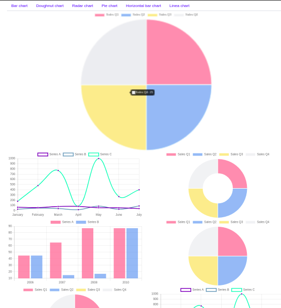

# Ngchart Demo



## Development server

Run `ng serve` for a dev server. Navigate to `http://localhost:4200/`. The app will automatically reload if you change any of the source files.

## Code scaffolding

Run `ng generate component component-name` to generate a new component. You can also use `ng generate directive|pipe|service|class|guard|interface|enum|module`.

## Build

Run `ng build` to build the project. The build artifacts will be stored in the `dist/` directory. Use the `--prod` flag for a production build.

## Chart.js (https://www.chartjs.org/)
The canvas generate a chart with the following, the dataset is the information to show, the charType define the type chart will be render, like bar chart or doughnut, it's easy to use, se below. In bar.html:
```
<canvas baseChart
        [datasets]="barChartData"
        [labels]="barChartLabels"
        [options]="barChartOptions"
        [legend]="barChartLegend"
        [chartType]="barChartType"></canvas>
```
On component.ts:
```
public barChartOptions = {
scaleShowVerticalLines: true,
resonsive: true
};
public barChartLabels = ['2006', '2007', '2008', '2010'];
public barChartType = 'bar';
public barChartLegend = true;
public barChartData = [
{data: [45, 65, 87, 87], label: 'Series A'},
{data: [45, 15, 17, 87], label: 'Series B'}
];
```

## Tutorials
https://medium.com/codingthesmartway-com-blog/angular-chart-js-with-ng2-charts-e21c8262777f</br>
https://valor-software.com/ng2-charts/